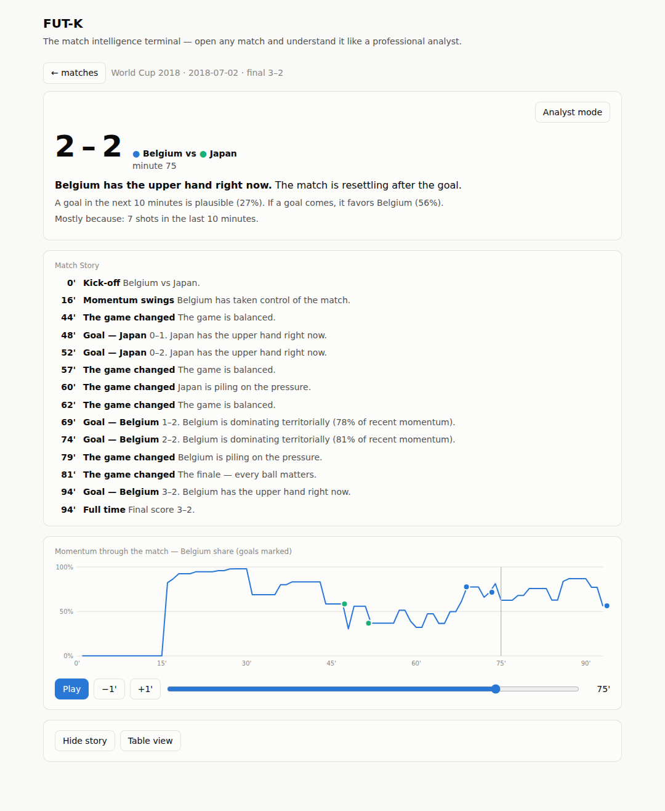
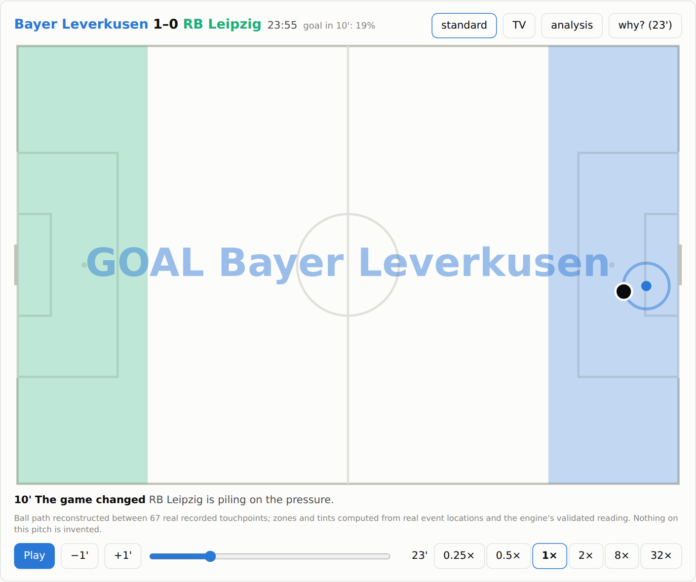
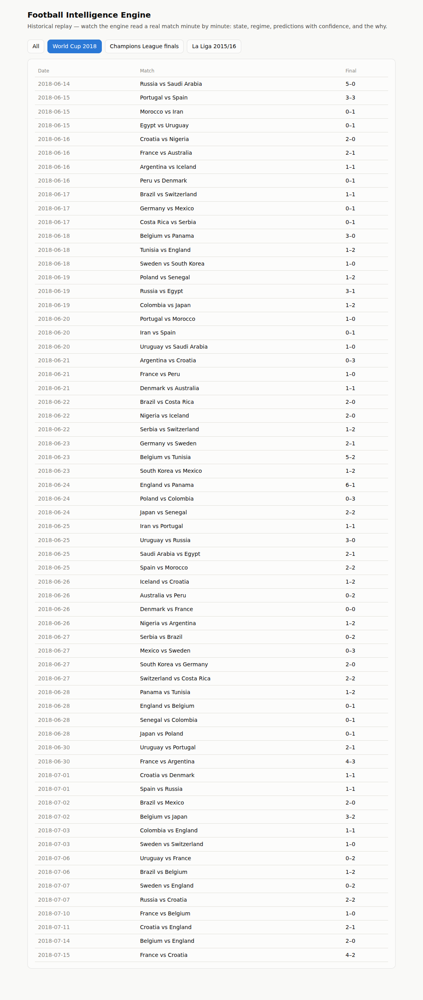
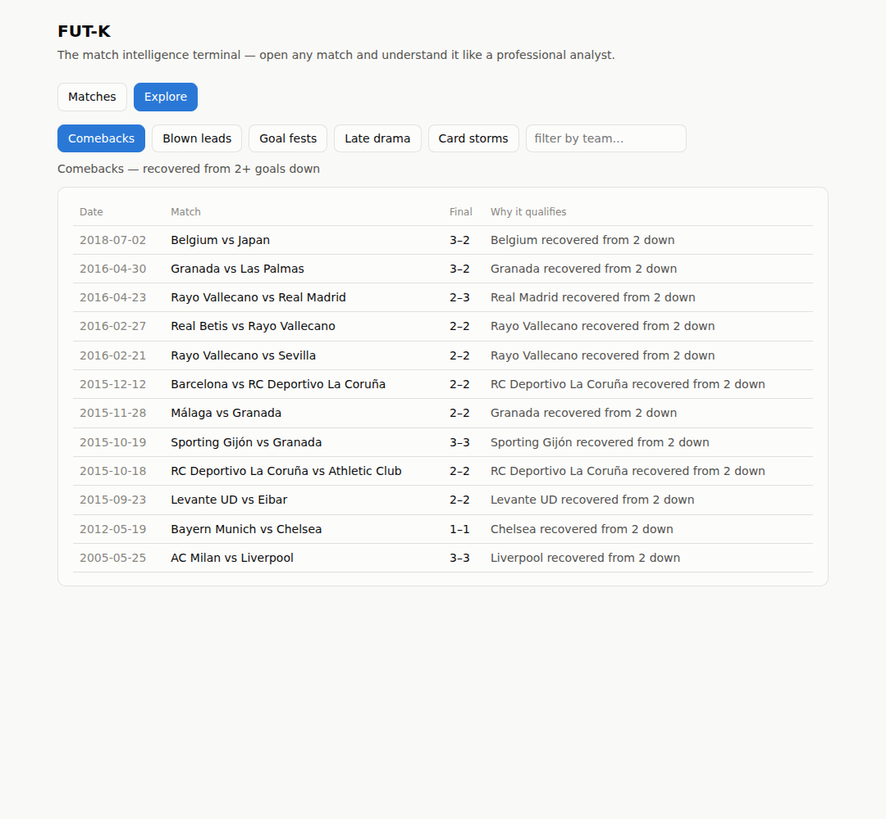
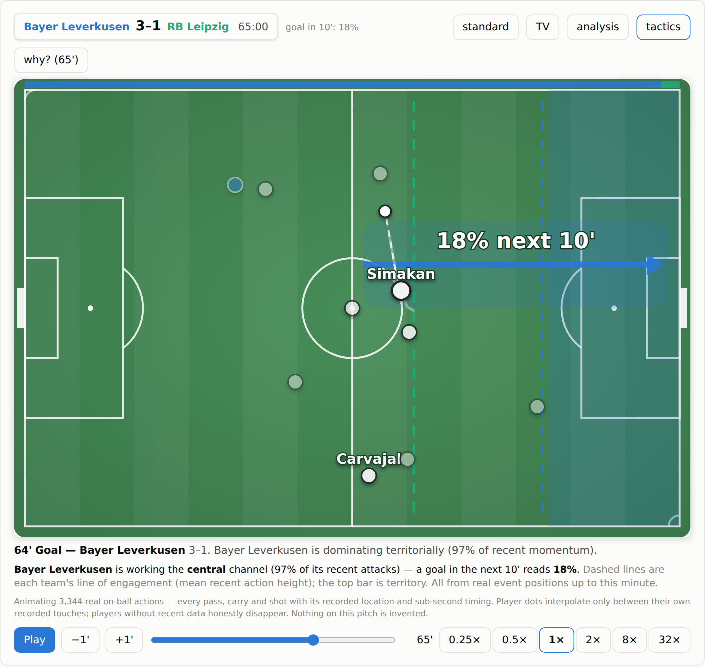
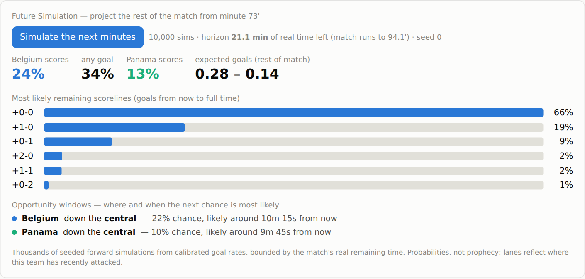
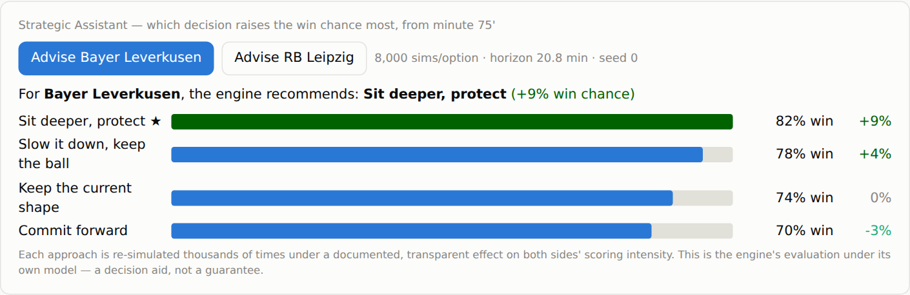
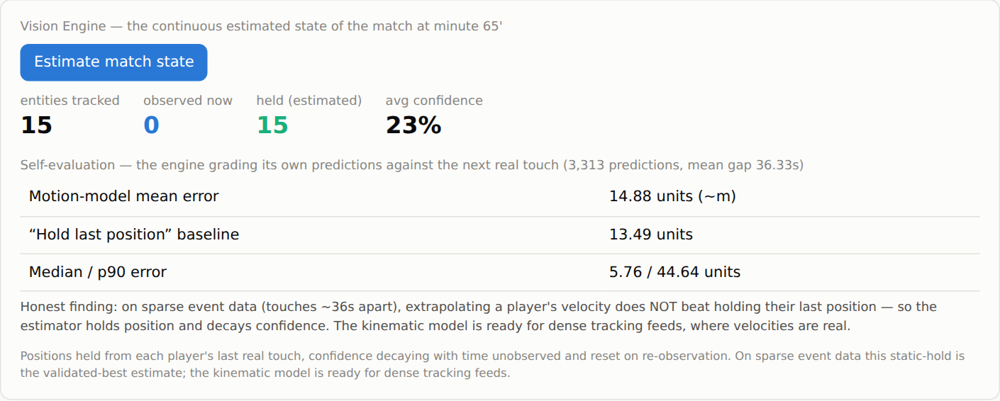

# FUT-K

**FUT-K is a Digital Football Twin** ([vision](./docs/VISION.md)): a living
computational representation of a football match that reconstructs the past,
understands the present, simulates possible futures, and turns tactical
intelligence into a visual, interactive, explainable experience.

> *"See the game beyond the game."*

**Capabilities**

- ✓ **Digital Match Twin** — the match reconstructed second by second, ball and players animated from real recorded actions
- ✓ **Match Intelligence** — momentum, pressure, regimes, calibrated goal probabilities with honest confidence
- ✓ **Counterfactual Simulation** — What If? (remove an event, re-read) + a Monte-Carlo Future Simulation Engine
- ✓ **Tactical Reasoning** — the intelligent field: engagement lines, territory, opportunity corridors
- ✓ **Data Fusion Engine** — many providers reconciled into one deterministic truth, with provenance and dissent
- ✓ **Explainable AI** — every claim traces to its evidence; ask the engine in plain language
- ✓ **Learning Engine** — recalibrates on new data, promotes only when held-out metrics don't degrade
- ✓ **Vision Engine** — a continuous, self-correcting state estimate: entities held with decaying confidence, corrected on re-observation, grading its own error
- ✓ **Live Mode** — the same engine fed one observation at a time through an event bus; the streamed state provably equals the batch panel
- ✓ **Scout AI (foundations)** — season-by-season evolution timelines, behavioral similarity, a transparent scouting index over real cohorts, and Wikidata-fused bios with provenance ([docs/SCOUT.md](./docs/SCOUT.md))
- ✓ **Replay Intelligence** + **REST API** + **SDKs** (Python/JS) — every capability scriptable

Pick a real match and watch the engine read it minute by minute — who controls
the game, what is likely to happen next, and *why*.



Every number on that panel is recomputed live from the match's event stream
**using only information available up to that minute** — the engine is provably
leakage-free, and the claim is enforced by tests from the math core all the way
up to the HTTP API.

The **Digital Match Twin** turns that stream into a living 2D pitch: the ball
follows every recorded pass, carry and shot — real locations, real sub-second
timings, ~3,300 on-ball actions per match — while player dots glide between
their own recorded touches, names appear as they act, goals flash where they
actually happened, and a commentator line narrates as the clock runs the full
90'+ (extra time included) at 0.25× to 32×. Facts are cross-checked against
independent providers by the fusion layer (the ✓ chip):



## Quick start

Prerequisites: Python 3.11+, Node 20+, and a PostgreSQL database (SQLite works
for a quick look).

```bash
# 1. backend — install the engine (fie) first, then the API service
pip install -e .                     # the engine — standard-library only
pip install -e "./backend[dev]"      # the FastAPI service (depends on fie)
cd backend
export DATABASE_URL="postgresql+psycopg://user:pw@localhost:5432/futk"   # or omit for SQLite

# 2. ingest real matches (free StatsBomb open data; downloads on demand)
python scripts/ingest.py --pairs "43/3" --limit 20      # World Cup 2018
uvicorn app.main:app --port 8000

# 3. frontend — replay UI
cd ../frontend
npm install
npm run dev          # http://localhost:5173  (proxies /api -> :8000)
```

New here? The full **[step-by-step walkthrough](#how-to-use-fut-k--step-by-step)**
below explains every step and every screen.

Open the app, pick a match, press **Play**.



**Explore** turns the engine into a query system over football history — real
comebacks, blown leads, late drama — across every ingested match:



## How to use FUT-K — step by step

A complete walkthrough, from an empty machine to reading a match like an analyst.
Everything here runs on free, open data and needs no paid keys.

### 1. Prerequisites

- **Python 3.11+** and **Node 20+** (`python --version`, `node --version`).
- **git**, to clone the repo.
- A **PostgreSQL** database is recommended for real use, but you can skip it —
  FUT-K falls back to a local **SQLite** file with zero setup, which is perfect
  for a first look.
- Internet access on first run: match data is downloaded on demand from
  StatsBomb's free open-data repository.

### 2. Get the code and install

```bash
git clone https://github.com/fcadusims-droid/FUT-K.git
cd FUT-K

pip install -e .                     # the engine (fie) — standard-library only
pip install -e "./backend[dev]"      # the API service (FastAPI, SQLAlchemy)
```

> **Order matters:** the backend depends on the engine package `fie`, so install
> `.` (the engine) first. Installing the backend on its own will fail to find
> `fie`.

### 3. Choose where data is stored

FUT-K reads the `DATABASE_URL` environment variable.

```bash
# Option A — Postgres (recommended for real use)
export DATABASE_URL="postgresql+psycopg://user:pw@localhost:5432/futk"

# Option B — nothing to configure: omit DATABASE_URL and a local SQLite file
# (backend/fie_backend.db) is created automatically.
```

### 4. Ingest some real matches

Matches are pulled by competition/season id pairs. Run this from the `backend/`
folder (the same `DATABASE_URL` the API will use):

```bash
cd backend
python scripts/ingest.py --pairs "43/3" --limit 20        # 20 World Cup 2018 games
# more examples (comma-separate to load several at once):
#   --pairs "11/27"   La Liga 2015/16      --pairs "43/106"  World Cup 2022
#   --pairs "55/282"  Euro 2024            --pairs "9/281"   Bundesliga 2023/24
```

The first run downloads events from StatsBomb (cached under `.sb_cache/` so
re-runs are instant). It prints how many matches and player profiles it stored.

### 5. Start the API

```bash
uvicorn app.main:app --port 8000
```

Check it's alive: open <http://localhost:8000/health> (should return
`{"status":"ok"}`) and the interactive API docs at
<http://localhost:8000/docs>.

### 6. Start the web app

In a second terminal:

```bash
cd frontend
npm install
npm run dev            # opens http://localhost:5173 (it proxies /api → :8000)
```

Open <http://localhost:5173>. If the catalog is empty, you haven't ingested any
matches yet — go back to step 4.

### 7. Use the app

The app has five tabs across the top; every view has its own shareable URL
(e.g. `#/players`, `#/match/<id>`), and the header has a theme toggle
(Auto / Light / Dark).

- **Matches** — the catalog. Filter by competition, then click a match to open
  its replay.
- **Inside a match (the replay):**
  - Press **Play** to run the match minute by minute; change **speed**
    (0.25×–32×) and drag the timeline to seek. The 2D pitch animates from real
    recorded passes, carries and shots.
  - Switch the pitch view: **standard**, **TV**, **analysis** (activity zones,
    pressure), or **tactics** (engagement lines, territory, the opportunity
    corridor with live goal probability).
  - **Pause and click "why?"** on the pitch — the engine explains that moment.
  - Toggle **Analyst mode** to reveal the full technical panel (regime,
    confidence, momentum, prediction meters) instead of the plain-language view.
  - Scroll for the cards: **Future Sim** (thousands of forward simulations from
    this minute), **Strategy** (which approach raises the win chance most),
    **What If?** (remove a goal/card and re-read the match), **Vision** (the
    continuous estimated state), **Match Story**, **Similar matches**, the
    passing **Network**, and **Ask** (plain-language questions).
- **Players** — the Player DNA directory. Filter by archetype or drag the
  **min-confidence** slider; each row shows its evidence-based confidence and
  provenance (how many matches, which source). Click a player for the full card
  (with verified bio facts and the most similar observed profiles).
- **Scout** — the discovery radar: the ingested cohort ranked by a transparent
  scouting index, with position / max-age / confidence filters. Age filters use
  only verified birth dates (see [`docs/SCOUT.md`](./docs/SCOUT.md)).
- **Explore** — preset historical queries across every ingested match
  (comebacks from two down, blown leads, late drama, card storms).
- **Benchmarks** — the validated public numbers, each with the command that
  reproduces it.

### 8. (Optional) Follow a live match

FUT-K can be fed a live match from the free
[football-data.org](https://www.football-data.org/) API — see
[`docs/DATA_SOURCES.md`](./docs/DATA_SOURCES.md) for the full setup. In short:

```bash
export FOOTBALL_DATA_API_KEY="your-free-key"   # unlocks live goal/card events
# with the API running, poll a live match (fd_id from /v4/matches):
curl -X POST "http://localhost:8000/live/mygame/footballdata?fd_id=<id>"
```

The live twin builds a running score, a goal/card timeline and live **insights**
(momentum swings, "the game changed") — deterministic, nothing invented.

### 9. Drive it from code

Everything the UI does is a REST call, and there are thin SDKs:

```bash
curl "http://localhost:8000/matches"                          # list matches
curl "http://localhost:8000/matches/<id>/state?minute=73"     # the panel at 73'
curl "http://localhost:8000/matches/<id>/simulate?minute=80"  # forward sim
```

```python
# run from sdk/python/ (or add it to your path); stdlib only, no install needed
from futk import FutK
fk = FutK("http://localhost:8000")
print(fk.state("<match_id>", minute=73))
```

### 10. Run everything with Docker (alternative to steps 2–6)

```bash
docker compose up --build      # postgres + backend (:8000) + frontend (:8080)
```

Then open <http://localhost:8080> (you still ingest matches with the command in
step 4, run inside the backend container).

### Troubleshooting

- **`No matching distribution found for fie`** — install the engine first:
  `pip install -e .` from the repo root, then `pip install -e "./backend[dev]"`.
- **Empty match catalog** — you haven't ingested anything yet (step 4), or the
  API isn't running / not reachable at `:8000`.
- **Ingest fails to download** — you need internet access on first run;
  StatsBomb data is fetched on demand and then cached under `.sb_cache/`.
- **Port already in use** — start the API on another port
  (`uvicorn app.main:app --port 8001`) and update the frontend proxy target in
  `frontend/vite.config.ts`.
- **Live feed returns no events** — set a free `FOOTBALL_DATA_API_KEY`; without
  a key only the scoreboard (score/minute) is available, not goal/card events.

## What you get

- **Match catalog** — 611 real matches ready to ingest: the complete 2018 and
  2022 World Cups, Euro 2024, every Champions League final 1971–2019, the full
  La Liga 2015/16 season, and Leverkusen's unbeaten Bundesliga 2023/24
  (StatsBomb open data).
- **A plain-language panel** — "Belgium has the upper hand right now. A goal
  in the next 10 minutes is plausible (27%)." No jargon by default; the full
  technical panel (regimes, confidence, momentum, prediction meters) lives
  behind an **Analyst mode** toggle.
- **Digital Match Twin** — the living 2D pitch: the full match (90'+ and
  extra time) animated from every recorded pass, carry and shot at 0.25×–32×,
  in standard, minimalist **TV**, **analysis** or **tactics** mode; pause
  anywhere and ask **why?** — the engine explains the moment. Honest by
  construction: every coordinate is provider truth or an interpolation between
  one player's own recorded positions; nothing on the pitch is invented.
- **Tactical Reasoning — the intelligent field** — the `tactics` layer draws,
  from real event positions: each team's line of engagement (how high it's
  playing), the territory split, and the **opportunity corridor** — the lane
  the attacking side is working, as an arrow toward goal labelled with the
  live goal probability.

  
- **Future Simulation Engine** — from any minute, run 10,000 seeded
  Monte-Carlo simulations of the *remaining* match (a horizon derived from the
  match's real recorded duration — never a hardcoded 90) and see the outcome
  distribution and **opportunity windows**: the lanes and time slices where
  the next chance is most likely. Deterministic (the seed is shown) and
  calibrated (the Monte-Carlo provably converges to the analytic Poisson from
  the same validated rates).

  
- **Strategic Assistant** — *"which decision raises the win chance most?"* Each
  candidate approach (commit forward, sit deeper, keep the ball, hold shape) is
  re-simulated thousands of times and ranked by its change in win probability —
  combining What If? with the Future Simulation Engine. A model-based decision
  aid, honestly labelled as such.

  
- **Vision Engine** — a continuous, self-correcting state of the match: every
  entity is held with **decaying confidence** between observations and
  corrected when a real one arrives, and the engine **grades its own error**
  against reality. The shift is from *"what's in this frame?"* to *"what is the
  most likely state of the match right now?"* On sparse event data it honestly
  finds that holding a player's last position beats extrapolating velocity —
  and does exactly that; the kinematic model is ready for a dense tracking feed.

  
- **Match Story** — the narrated timeline: kick-off, goals in context, "the
  game changed" beats, momentum swings, full time. Click a beat to jump the
  replay there.
- **Signature visuals** — Momentum Timeline with goal markers, Pressure Index,
  Confidence Curve; play/pause, minute stepping, click-to-seek, table view.
- **Explore** — preset historical queries (comebacks from 2 down, blown leads,
  goal fests, late drama, card storms) with a team filter.
- **Ask the engine** — "what happened after minute 60?", "why did they lose?",
  "did the referee change the game?" — deterministic answers built from the
  engine's own reading (no external language model).
- **Similar matches** — semantic search by game dynamics: momentum flow, goal
  timing, swings. "Matches that felt like this one."
- **Benchmarks tab** — the validated public numbers, each with the one command
  that reproduces it.
- **Player DNA** — per-player profiles built from real event data (pass
  accuracy, progression, key passes, archetypes like *finisher* / *creator*),
  each carrying an evidence-based **confidence** (a documented, saturating
  function of on-ball volume — 0.5 at the archetype threshold, never certainty)
  and its **provenance** (the contributing match count and data sources).
  Nothing is fabricated: unmeasured fields stay empty, and a profile with no
  recorded source reports none. Served by the API, filterable by
  `min_confidence`.

## Architecture

```text
StatsBomb open data ──ingest──> PostgreSQL ──FastAPI──> React replay UI
     (event-level)               (backend/)  (REST API)   (frontend/)
                                      │
                               engine: src/fie
                    (pure-Python, standard-library only,
                     259 tests, leakage-safe by construction)
```

| Directory | What it is |
|---|---|
| [`docs/ARCHITECTURE.md`](./docs/ARCHITECTURE.md) | **the stable core**: 4 layers (Core → Inference → Knowledge → Application), one dependency rule, enforced by a test |
| [`plugins/`](./plugins/) | drop-in match-metric plugins (reference: `expected_chaos`) — extend FUT-K with zero core edits |
| [`backend/`](./backend/) | FastAPI service: production schema, multi-competition ingestion pipeline, replay/prediction API |
| [`frontend/`](./frontend/) | React + Vite app: the match catalog and the minute-by-minute intelligent panel |
| [`src/fie/`](./src/fie/) | the engine — one module per section of the design document (indices, Poisson prediction, regimes, confidence, players, narrative, calibration, learning, fusion) |
| [`validation/`](./validation/) | **empirical validation**: datasets, methodology, metrics, baselines, negative results, and how to reproduce everything |
| [`docs/design/`](./docs/design/) | the founding design document and the numbered validation test plan |
| [`tests/`, `scripts/`](./tests/) | the engine's test suite (89 spec'd test IDs) and the real-data experiment scripts |

## Empirical validation — the evidence

The engine is not just designed to be honest; it is **measured**. Headline
results (full methodology, tables, and reproduction commands in
[`validation/README.md`](./validation/README.md)):

| Claim | Evidence |
|---|---|
| Algorithms match their spec | 89 numbered synthetic tests, multi-seed Monte-Carlo, 348 tests green in CI |
| No information leakage | the **73:15 test** (§ below): 5,499 erase-the-future comparisons over all 611 matches, 100% byte-identical — enforced at engine **and** HTTP level on every push |
| Calibrated on real football | walk-forward on WC 2018 (fitting closes a wrong prior: gap 0.040 → 0.025) **and** on all 380 La Liga 2015/16 matches (a right prior stays right: gap 0.009) |
| **Externally anchored** | on real Bet365 odds, the ordering is exactly right: naive baseline (LL 1.050) < Elo (1.007) < **engine's Poisson (0.976)** < market (0.916) — sane machinery, no market-beating claims |
| Multi-target | corners and cards now scored on real data (4,878 held-out snapshots each), not just goals |
| Distinguishes competitions | CL finals score 2.70 goals/90 vs La Liga 2.28; each competition's fitted parameters win on its own data |
| Honest negatives kept | per-regime calibration rejected; learned model rejected; naive pressure-scaling of corners/cards rejected — all by held-out data |
| Player layers face-valid | top scorers/creators recovered correctly (Kane, Neymar, Özil…); Barcelona's passing network recovers Busquets as pivot and Alba→Neymar as the strongest link |
| **Cross-provider truth** | 3 independent providers fused deterministically (majority voting, provenance, recorded dissent); goals and half-time scores agree 100% — and the vote caught a real blind spot in our own extraction (own goals) |

The two rejected experiments stay in the record on purpose: in this project a
validated "no" outranks an unvalidated "yes".

## The 73:15 test — proof the predictions are real

One question defines whether an in-play model is honest:

> *Stop a match at exactly 73:15 and erase everything that happened after
> that instant. Does FUT-K still produce **exactly** the same prediction it
> produced originally?*

If yes, the model does not depend on the future. If no, information is
leaking. We ran this adversarially, on real data, at three levels — and the
answer is yes at every one:

**1. The literal scenario — Belgium 3–2 Japan (WC 2018), stopped at 73:15.**
The most famous comeback in the dataset, chosen on purpose: at 73:15 Japan
led 2–1, and the 24 erased events include both of Belgium's comeback goals.

```text
prediction with full history : goal_next_10min: 0.19, next_goal: {home: 0.695, away: 0.305}
prediction with future erased: goal_next_10min: 0.19, next_goal: {home: 0.695, away: 0.305}
byte-identical panels: True
```

The 69.5% next-goal lean toward Belgium comes from Belgium's pressure *up to
that minute* — not from knowing the comeback happened.

**2. At scale, engine level.** Every ingested match (611, across all six
competitions) × 9 cutoffs each, including 73.25 and the 44.9' edge just
before half-time: **5,499 comparisons, 5,499 byte-identical (100%)**.

**3. The deployed path, database included.** For 24 sampled matches we
created clones whose post-cutoff events were **deleted from the database
itself**, then compared the live API's responses (`/state`, `/state/human`,
`/explain`) between original and clone: **360 comparisons, 360
byte-identical**. Not a promise about the code — a measurement of the
running service.

Reproduce it yourself on whatever you have ingested (including your own
datasets):

```bash
cd backend
python scripts/prove_no_leakage.py     # exits non-zero on any leakage
```

And the property is not a one-off audit: it fails the build on every push —
T-20-04 at the engine level (`pytest tests/test_calibration.py -k leak`), the
HTTP-level twin (`cd backend && pytest tests/test_replay_api.py -k leak`), and
the same erase-the-future gate on the **Future Simulation** path (engine and
`/simulate` endpoint). Measured predictive precision of that leakage-free sim
against known results: validation §5.11.

One honest boundary: in the 2D **replay** the ball glides toward the *next*
recorded touchpoint — that uses the future, because a replay is a
visualization of a finished match, not a prediction. Every predictive number
on screen (probabilities, momentum, regime, confidence) comes from the
sliced panel proven above.

## Design documents

The founding document — the full architecture of the *Digital Model of the
Match*, the twelve intelligences, and the honest-risks list — is
[`docs/design/football_intelligence_engine.md`](./docs/design/football_intelligence_engine.md),
with its executable companion
[`docs/design/validation_test_plan.md`](./docs/design/validation_test_plan.md).

The **Dataset Fusion** — the unified knowledge substrate that keeps every datum
tied to its context, provenance and moment in time, and makes it impossible to
mix data across the boundaries that give it meaning — is
[`docs/design/DATASET_FUSION.md`](./docs/design/DATASET_FUSION.md)
(the integrity & isolation contract in [`src/fie/fusiondata.py`](./src/fie/fusiondata.py)).

## Roadmap (product phase)

Validation stage is closed — see [`validation/README.md`](./validation/README.md).
Next: FUT-K as a product. The full, phased plan (with effort, risk and status)
lives in [`docs/ROADMAP.md`](./docs/ROADMAP.md).

- ✓ **Player pages in the app** — a deep-linkable Player DNA directory
  (`#/players`) with an archetype filter and a confidence slider, each profile
  showing its evidence-based confidence and provenance
- 🟡 **Live feed** — a free [football-data.org](https://www.football-data.org/)
  source (`fie.sources.footballdata`) is wired into Live Mode
  (`POST /live/{id}/footballdata`); add a free `FOOTBALL_DATA_API_KEY` to unlock
  goal/card events. Sources, access tiers and honest limits:
  [`docs/DATA_SOURCES.md`](./docs/DATA_SOURCES.md)
- Richer in-play features (the open research question from validation §7)
- Replicate full-league numbers on more Big-5 seasons

Also in the repo: **SDKs** (Python + JavaScript, [`sdk/`](./sdk/)), the
**user guide** ([`docs/guide/`](./docs/guide/)) explaining Confidence, Regimes,
Consensus and the panel, and the **product definition**
([`docs/product/PRODUCT.md`](./docs/product/PRODUCT.md)).

## Bring your own data

FUT-K is not married to its datasets. Anyone can ingest their own event data
(an open CSV/JSON format — 7 fields) and **calibrate the model on it**, with
the same held-out promotion gate that protects the official numbers:

```bash
cd backend
python scripts/ingest_custom.py --file my_events.csv --competition my-league
python scripts/recalibrate.py   --from-db --competition my-league
```

Your matches replay in the app (2D pitch included), and the refit ships only
if it does not degrade held-out log loss — the gate means you cannot hurt
yourself. Full walkthrough: [`docs/CUSTOM_DATA.md`](./docs/CUSTOM_DATA.md),
sample dataset in [`examples/`](./examples/).

## Running it as a service

```bash
docker compose up --build     # postgres + backend (:8000) + frontend (:8080)
```

Operations are built in: `GET /metrics` (per-route latency/errors) and
`/metrics/prometheus`; optional API keys + rate limiting via env
(`FUTK_API_KEYS`, `FUTK_RATE_LIMIT`); incremental audited data refresh
(`backend/scripts/refresh.py`, history in `ingestion_runs`); and the
**continuous learning cycle** (`backend/scripts/recalibrate.py`) — refit on
new data, promote **only if held-out metrics don't degrade**, version history
at `GET /model/versions`, the panel always serving the latest promoted
version. See [`docs/DEPLOYMENT.md`](./docs/DEPLOYMENT.md) and
[`PRIVACY.md`](./PRIVACY.md).

## License & credits

**FUT-K** — created by **João Vitor Perazzolo** (*Johnny Kestler*).

- Code: **AGPL-3.0** (see [`LICENSE`](./LICENSE)) — use it, study it, improve
  it; improvements stay open.
- Commercial licensing available separately — see [`LICENSING.md`](./LICENSING.md).
- Contributions are accepted under the [`CLA`](./CLA.md).
- Match data: [StatsBomb Open Data](https://github.com/statsbomb/open-data),
  under StatsBomb's own non-commercial terms (not redistributed here).
